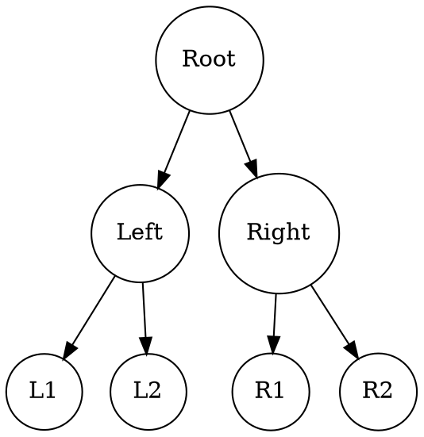
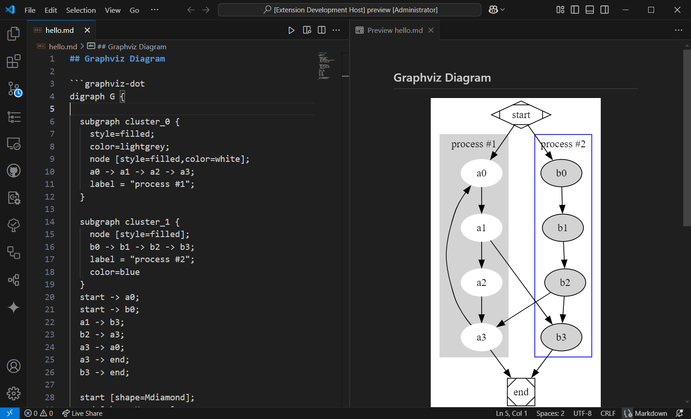
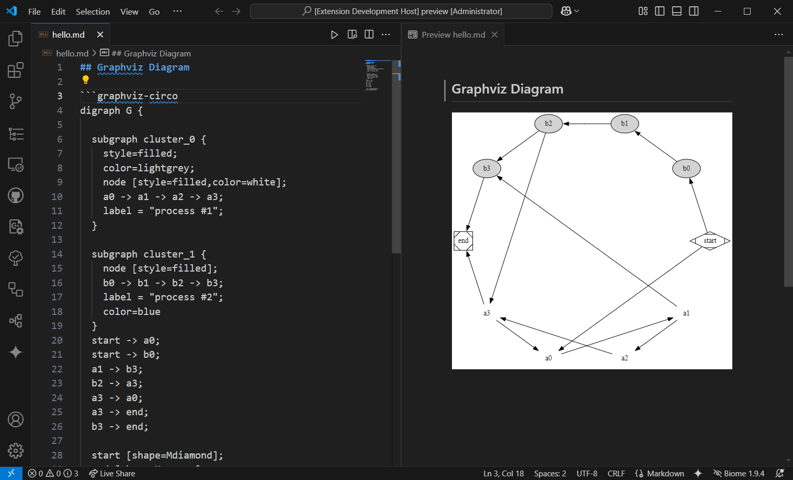

# Markdown Graphviz Preview

A Visual Studio Code extension that allows you to preview Graphviz diagrams directly in your markdown files. This extension uses [Viz.js](https://github.com/mdaines/viz-js) for Graphviz rendering.

## Features

- Preview Graphviz diagrams in Markdown files with support for multiple layout engines.
- Uses Viz.js for rendering Graphviz graphs.

## Installation

1. Install the **Markdown Graphviz Preview** extension in Visual Studio Code.
2. Open a markdown file and start writing Graphviz code blocks.

## Usage

### Basic Example

To render a simple binary tree with `dot` Engine, use the `graphviz-dot` or `dot` language block. Here's an example using the `dot` layout engine:

````markdown

````

Or use `graphviz-dot` language mark,

````markdown

````

This will render the diagram in your markdown preview:



### Changing Layout Engines

You can also change the layout engine by changing the language suffix in the code block. For example, to use the `circo` engine, change the block’s language to `graphviz-circo` or `circo`.

````markdown
```circo
digraph BinaryTree {
    node [shape=circle];

    A -> B;
    A -> C;
    B -> D;
    B -> E;
    C -> F;
    C -> G;

    A [label="Root"];
    B [label="Left"];
    C [label="Right"];
    D [label="L1"];
    E [label="L2"];
    F [label="R1"];
    G [label="R2"];
}
```
````

Or use `graphviz-circo` language mark,

````markdown

````

This will render the diagram with the `circo` engine:



### Layout Engines

If you don't specify any engine, it will take `dot` engine as the default engine. For more information on available layout engines, check the [Graphviz documentation](https://graphviz.org/docs/layouts/).

## Related Projects

- [Graphviz](https://gitlab.com/graphviz/graphviz)
- [Viz.js](https://github.com/mdaines/viz-js)

## License

MIT © [但为君故](https://github.com/prinorange)
